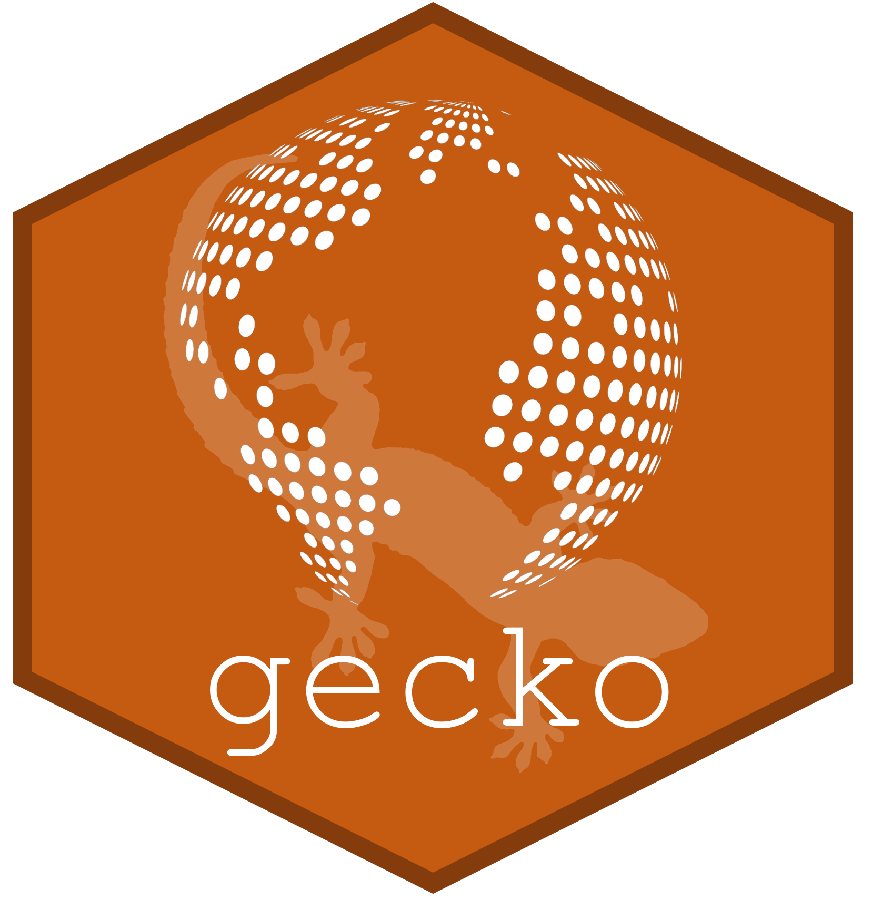

# gecko 
Geographical Ecology and Conservation Knowledge Online

GECKO is an *R* package and suite of geographical analysis functions aimed primarily at ecology and conservation science studies. 

It currently incorporate easy access to SPECTRE, a novel set of standardized, high-resolution global raster layers, each a potential threat to endangered species. 
Check out SPECTRE at [LIBRe](https://biodiversityresearch.org/spectre/). There you can find a handy dashboard allowing for quick visualization of each layers and instructions on alternative was of accessing SPECTRE, such as through
[Paituli](https://paituli.csc.fi/). Also check out our [data paper](https://doi.org/10.1111/geb.13949) describing SPECTRE in full, including the sources and methodologies used to create each layer.

## Installation
As gecko is available from CRAN, you can use `install.packages("gecko")` to get the current released version. Alteratively, install the latest release through `remotes::install_github("VascoBranco/gecko")`.
